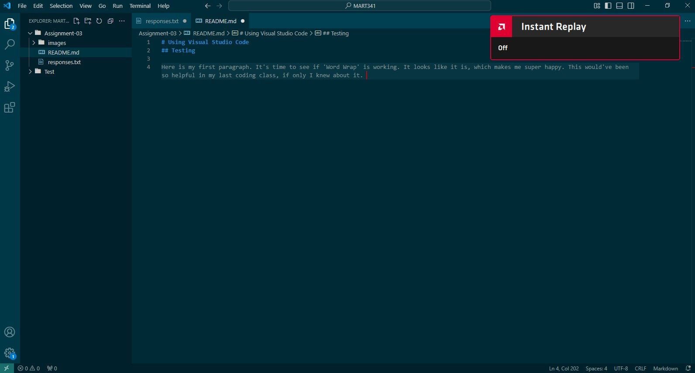

# Using Visual Studio Code 
## Testing

Here is my first paragraph. It's time to see if 'Word Wrap' is working. It looks like it is, which makes me super happy. This would've been so helpful in my last coding class, if only I knew about it. 

[response](responses.txt)